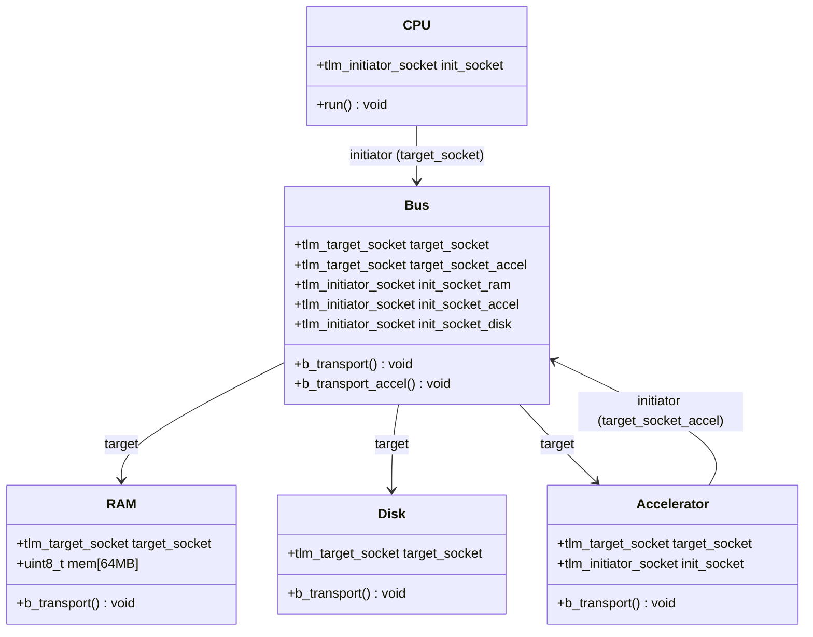
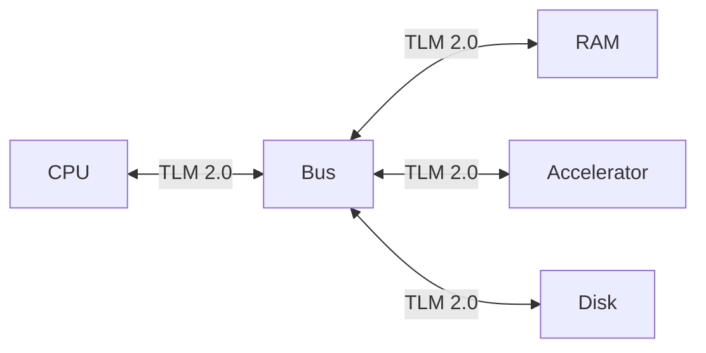
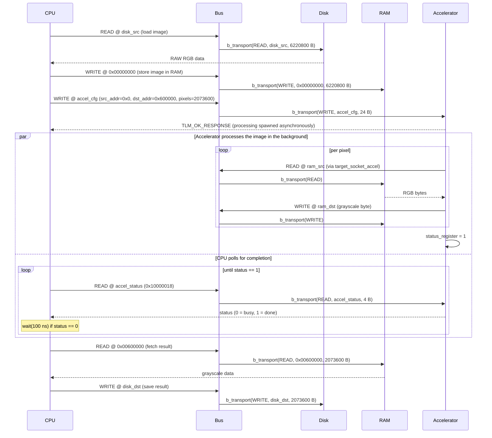

# SystemC Image Processing — TLM 2.0

> Academic project — Diseño de Alto Nivel, 2C 2026 · Due 2026-06-18

An electronic system-level model of an embedded platform that converts 1080p RAW RGB images to grayscale using **SystemC** and **TLM 2.0**.

---

## Table of Contents

- [Requirements & Build Instructions](#requirements--build-instructions)
- [Repository Organization](#repository-organization)
- [Module Organization](#module-organization)
- [Block Diagram](#block-diagram)
- [Sequence Diagram](#sequence-diagram)
- [Transaction Format](#transaction-format)
- [Memory Map](#memory-map)
- [Results](#results)
- [AI-Assisted Development](#ai-assisted-development)

---

## Requirements & Build Instructions

There are two ways to build this project:

1. **[Development Container](#development-container) (recommended)** — Docker-based, every dependency (including a pre-compiled SystemC 2.3.4) is already installed inside the container, so the build is identical regardless of host OS. No local toolchain setup needed.
2. **[Local Build](#local-build)** — install the [prerequisites](#system-prerequisites) directly on your machine and build with `make`.

### Development Container

The repository ships a ready-to-use dev container that pre-installs all dependencies (including a compiled SystemC 2.3.4), so anyone who clones it gets an identical Linux build environment regardless of their host OS.

#### VS Code (recommended)

1. Install the [Dev Containers](https://marketplace.visualstudio.com/items?itemName=ms-vscode.remote-containers) extension (`ms-vscode.remote-containers`)
2. Open the repository in VS Code
3. When prompted, click **Reopen in Container** (or run the command `Dev Containers: Reopen in Container`)
4. The container builds once (~3–5 min on first run), then `make` runs automatically to verify the setup

The following extensions are pre-installed inside the container:
- **C/C++** (`ms-vscode.cpptools`) — IntelliSense, debugging
- **CMake Tools** (`ms-vscode.cmake-tools`) — build integration

#### Docker CLI (without VS Code)

```bash
docker build -t systemc-tlm .devcontainer/
docker run -it --rm -v $(pwd):/workspace -w /workspace systemc-tlm make run
```

#### GitHub Codespaces

The same `devcontainer.json` works on [GitHub Codespaces](https://github.com/features/codespaces) — click **Code → Codespaces → Create codespace** for a cloud-hosted environment with no local install required.

### Local Build

#### System prerequisites

| Dependency | Minimum version | Notes |
|---|---|---|
| C++ compiler | GCC ≥ 9 or Clang ≥ 10 | Must support C++17 |
| CMake | ≥ 3.16 | Used for both building and fetching SystemC |
| Git | any | To clone the repository |
| Internet access | — | Required on first build to download SystemC (skipped if `$SYSTEMC_HOME` is set) |

**Linux (Ubuntu/Debian):**
```bash
sudo apt-get update
sudo apt-get install -y build-essential cmake git
```

**macOS:**
```bash
xcode-select --install       # provides clang and make
brew install cmake git
```

#### Build

```bash
git clone <repository-url>
cd <repository>
make      # configure + download SystemC (first run ~1-2 min) + compile
make run  # build and run the simulation
make clean  # delete build directory
```

On the first run, CMake downloads and compiles SystemC 2.3.4 automatically. Subsequent builds use the cached version inside `build/`.

If SystemC is already installed, set `$SYSTEMC_HOME` before running `make` to skip the download:

```bash
export SYSTEMC_HOME=/opt/systemc   # adjust to your install path
make run
```

#### RTL backend (optional)

`make run` uses the C++ RAM and needs nothing beyond the above. To run the system against the **Verilog AXI4-Full RAM** instead, install [Verilator 5](https://verilator.org/guide/latest/install.html) and:

```bash
make lint      # verilator --lint-only -Wall on src/rtl/
make run-rtl   # same pipeline, RAM served by the Verilog RTL over DPI
```

> ⚠️ **Verilator cannot build from a path containing spaces.** Its `verilated.mk` is a GNU Make file, and CMake's `verilate()` fails too. Clone into a space-free path, or use the [dev container](#development-container), which mounts at `/workspace`. `scripts/build_rtl.sh` detects this and tells you. CI is unaffected.

Without Verilator the project still builds — `sim` just rejects `--rtl-ram` with an explanatory message.

### CI / CD

Every pull request triggers a GitHub Actions workflow ([build.yml](.github/workflows/build.yml)) that builds SystemC (cached), compiles the project, runs `./build/sim`, regenerates the input/output JPGs, and commits the live results (images + the `<!-- RESULTS:* -->` tables in this README) back to the PR branch. To enforce this on `master`, enable branch protection and require the `build` check to pass before merging.

---

## Repository Organization

```
.
├── .devcontainer/
│   ├── Dockerfile                 # Linux image with SystemC pre-built
│   └── devcontainer.json          # VS Code / Codespaces dev container config
├── .github/
│   └── workflows/
│       └── build.yml              # CI: compiles, runs, and commits live results/images on every pull request
├── docs/
│   ├── CrearModuloSystemC.md      # Step-by-step guide for implementing a new module
│   ├── ArquitecturaDPI.md         # RTL port map + DPI bridge design (Spanish)
│   ├── PlanUVM.md                 # Verification plan: features, tests, coverage
│   ├── Enunciado.md               # Assignment specification (Spanish)
│   └── old/Enunciado.md           # Previous assignment (Evaluación 2), for reference
├── images/
│   ├── input/                     # Input RAW RGB images (place here before running)
│   └── output/                    # Grayscale output images (written here by sim)
├── scripts/
│   ├── prepare_input.py           # Converts/generates images/input/image.raw for the sim
│   ├── raw_to_jpg.py              # Converts a headerless RAW file back to JPG/PNG for viewing
│   ├── jpg_to_raw.py              # Converts a JPG/PNG into headerless RAW for the sim
│   ├── generate_results.py        # Extracts sim time, byte counts, and BT.601 pixel checks for CI
│   ├── build_rtl.sh               # Verilates the RTL + DPI bridge (standalone, no CMake)
│   ├── run_uvm.sh                 # Runs the UVM testbench in Vivado XSim (Linux/macOS)
│   ├── run_uvm_windows.ps1        # Same flow on Windows: env setup → clone → sim → exports/
│   └── run_uvm_windows.bat        # Launcher for the PowerShell script
├── src/                           # All source, grouped by subsystem
│   ├── model/                     # SystemC / TLM 2.0 model
│   │   ├── modules/
│   │   │   ├── accelerator/       # accelerator.h / .cpp
│   │   │   ├── bus/               # bus.h / .cpp
│   │   │   ├── cpu/               # cpu.h / .cpp
│   │   │   ├── disk/              # disk.h / .cpp
│   │   │   ├── ram/               # ram.h / .cpp — C++ reference RAM
│   │   │   └── ram_axi/           # TLM ↔ DPI bridge to the Verilog RAM
│   │   ├── config/
│   │   │   ├── memory_map.h       # Bus address map constants
│   │   │   └── image_config.h     # Image dimension constants
│   │   ├── utils/
│   │   │   └── conversion.h       # Pure BT.601 helper (no SystemC dependency)
│   │   ├── infra/
│   │   │   └── logger.h           # Centralized console logging
│   │   └── sc_main.cpp            # sc_main — top-level instantiation and sc_start()
│   ├── rtl/
│   │   └── axi4_ram.v             # 64 MB RAM with an AXI4-Full slave port (Verilog-2001)
│   ├── tb/
│   │   ├── uvm/                   # UVM testbench for axi4_ram (agent, scoreboard, sequences)
│   │   └── files.f                # Filelist consumed by xvlog
│   └── dpi/
│       ├── axi_ram_dpi.svh        # DPI contract — SystemVerilog side (frozen)
│       ├── axi_ram_dpi.h          # DPI contract — C++ side (frozen)
│       ├── axi_ram_dpi.sv         # AXI master BFM + axi4_ram instance
│       └── axi_ram_dpi.cpp        # Verilated model owner + clock ticking
├── AGENTS.md                      # AI assistant instructions
├── CMakeLists.txt                 # Build system; auto-fetches SystemC if needed
├── CLAUDE.md                      # Context file for Claude Code
├── Makefile                       # Thin CMake wrapper
└── README.md
```

---

## Module Organization



| Module | File(s) | TLM role | Responsibility |
|---|---|---|---|
| **CPU** | `src/modules/cpu/` | Initiator | Orchestrates the full flow: load → store → configure → fetch → save |
| **Bus** | `src/modules/bus/` | Target + Initiator | Routes transactions to the correct target by address range |
| **RAM** | `src/modules/ram/` | Target | 64 MB byte-addressable memory; holds input RGB and output grayscale |
| **Disk** | `src/modules/disk/` | Target | Maps READ/WRITE transactions to local filesystem file I/O |
| **Accelerator** | `src/modules/accelerator/` | Target | On WRITE to config registers, reads RGB from RAM and writes grayscale back |

---

## Block Diagram



### CPU

The CPU orchestrates the entire processing pipeline. It initiates all TLM transactions: loading the raw image from Disk into RAM, configuring the Accelerator with the source address, destination address, and pixel count, then polling the Accelerator's status register every 100 ns until processing is done, and finally fetching the processed image back from RAM and saving it to Disk. The CPU holds no image data locally — RAM is the only intermediate buffer.

### Bus

The Bus has two TLM target sockets: `target_socket`, for transactions coming from the CPU, and `target_socket_accel`, for transactions coming from the Accelerator. The CPU-facing socket decodes the address and routes it to RAM (`0x00000000`–`0x03FFFFFF`), Accelerator (`0x10000000`–`0x1FFFFFFF`), or Disk (`0x20000000`–`0x2FFFFFFF`); the Accelerator-facing socket only forwards to RAM, since the Accelerator only ever reads/writes pixel data there. All inter-module communication passes through the Bus.

### RAM

A 64 MB byte-addressable memory array. It holds the input RGB image starting at `0x00000000` and the output grayscale image starting at `0x00600000`. All inter-module data exchange passes through RAM — neither the CPU nor the Accelerator transfer image data directly to each other.

### Disk

Models the persistent file system as a SystemC module. A TLM READ transaction causes it to open the specified image file and return its bytes; a TLM WRITE transaction creates or overwrites a file with the provided data. It is the only module that performs actual filesystem I/O, keeping the rest of the system independent of the host OS.

### Accelerator

On receiving a 24-byte WRITE to its configuration register at `0x10000000`, the Accelerator spawns an asynchronous process (`sc_spawn`) that reads the source RGB pixels from RAM, converts each pixel to grayscale, and writes the result back to RAM at the destination address — the configuration WRITE itself returns immediately, it does not block until processing is done. While processing, a status register at `0x10000018` reads `0`; once the loop finishes, it's set to `1` so the polling CPU can proceed. It uses the **BT.601 luminosity formula**:

```
Gray = 0.299 × R + 0.587 × G + 0.114 × B
```

**Input:** 3 bytes per pixel (RGB, values 0–255)  
**Output:** 1 byte per pixel (Grayscale, 0–255, rounded)

This formula reflects human eye sensitivity to different color channels:
- Green (58.7%): highest sensitivity
- Red (29.9%): medium sensitivity
- Blue (11.4%): lowest sensitivity

**Example:** RGB(100, 150, 200) → 0.299×100 + 0.587×150 + 0.114×200 = 140.75 ≈ 141 (grayscale)

See [Roboflow Image Convert Grayscale](https://inference.roboflow.com/workflows/blocks/image_convert_grayscale/) for reference.

---

## Sequence Diagram



---

## Transaction Format

All inter-module communication uses the TLM 2.0 generic payload (`tlm::tlm_generic_payload`).

| Field | Type | Description |
|---|---|---|
| `command` | `tlm_command` | `TLM_READ_COMMAND` or `TLM_WRITE_COMMAND` |
| `address` | `uint64_t` | Absolute byte address on the bus (Bus resolves to target) |
| `data_ptr` | `unsigned char*` | Pointer to the data buffer |
| `data_length` | `unsigned int` | Transfer size in bytes |
| `response_status` | `tlm_response_status` | `TLM_OK_RESPONSE` on success, `TLM_GENERIC_ERROR_RESPONSE` on failure |

### Accelerator configuration transaction

When the CPU configures the Accelerator, it issues a single 24-byte WRITE to the Accelerator's base address:

| Offset | Size | Field |
|---|---|---|
| `+0` | 8 B | Source base address in RAM (input RGB) |
| `+8` | 8 B | Destination base address in RAM (output grayscale) |
| `+16` | 8 B | Total pixel count |

### Accelerator status transaction

The CPU does not block on the configuration WRITE — the Accelerator spawns the pixel-processing loop asynchronously (`sc_spawn`) and returns immediately. To know when processing finished, the CPU polls a 4-byte status register at `accel_base + 0x18` with a READ, waiting 100 ns between polls while the value is `0`:

| Offset | Size | Field | Values |
|---|---|---|---|
| `+24` (`0x18`) | 4 B | Status register | `0` = processing, `1` = done |

---

## Memory Map

The Bus routes transactions based on address range.

| Region | Base Address | Size | Module |
|---|---|---|---|
| Input RGB image | `0x00000000` | 6,220,800 B (~5.9 MB) | RAM |
| Output grayscale image | `0x00600000` | 2,073,600 B (~1.9 MB) | RAM |
| *(free RAM)* | `0x007F9C00` | ~56 MB remaining | RAM |
| Accelerator config | `0x10000000` | 24 B | Accelerator |
| Accelerator status | `0x10000018` | 4 B | Accelerator |
| Disk | `0x20000000` | — | Disk |

RAM total capacity: 64 MB (`0x00000000` – `0x03FFFFFF`).

---

## Results

> Images and the tables below are regenerated **and committed automatically** by CI ([build.yml](.github/workflows/build.yml)) on every pull request that touches `src/`, `scripts/`, or the input image — `scripts/generate_results.py` writes real measured values straight into this README between the `<!-- RESULTS:* -->` markers, so the numbers below are never hand-copied.

### Output image

| Input (RGB) | Output (Grayscale) |
|:-----------:|:------------------:|
|  |  |

The output is visually correct because BT.601 weights each channel by human eye sensitivity (green 58.7%, red 29.9%, blue 11.4%): every feature from the input — mountains, sun, lake reflection, tree line, golden and blue vegetation — stays distinguishable, and the blue-toned vegetation (high blue+green) renders lighter than the similarly-bright golden vegetation (high red, low blue), as the weighting predicts.

### Data volume

A 1920×1080 image has 2,073,600 pixels. RGB input is 3 B/pixel, grayscale output is 1 B/pixel, so the expected byte counts are 2,073,600 × 3 = 6,220,800 B (Disk → RAM) and 2,073,600 × 1 = 2,073,600 B (RAM → Disk). `scripts/generate_results.py` reads `images/input/image.raw` / `images/output/output.raw` directly on every CI run and fills in the measured values below:

<!-- RESULTS:DATA-VOLUME:START -->
| Transfer | Expected | Actual | Match |
|---|---|---|---|
| Disk → RAM (input) | 6,220,800 B | 6,220,800 B | ✅ |
| RAM → Disk (output) | 2,073,600 B | 2,073,600 B | ✅ |
| Total moved | 8,294,400 B | 8,294,400 B | ✅ |
<!-- RESULTS:DATA-VOLUME:END -->

### Pixel-level conversion check

On every CI run, `scripts/generate_results.py` samples 4 pixels, recomputes BT.601 independently in Python from the input RGB, and compares against what the C++ Accelerator (`src/utils/conversion.h`) actually wrote — confirming correctness at the pixel level, not just by eye:

<!-- RESULTS:PIXELS:START -->
| Pixel # | RGB | Expected gray (BT.601) | Actual gray | Match |
|---|---|---|---|---|
| 0 | (139, 118, 209) | 135 | 135 | ✅ |
| 518,400 | (192, 173, 205) | 182 | 182 | ✅ |
| 1,036,800 | (59, 56, 47) | 56 | 56 | ✅ |
| 2,073,599 | (45, 48, 101) | 53 | 53 | ✅ |
<!-- RESULTS:PIXELS:END -->

### Pipeline phases

The CPU logs 5 phases, in a fixed order with no branching (`CPU::run()` executes them sequentially):

| CPU log | Action |
|---|---|
| `[1/5] Loading image from disk` | CPU reads the RAW RGB image from persistent storage (Disk) |
| `[2/5] Storing image in RAM` | CPU writes the loaded image into RAM |
| `[3/5] Configuring accelerator` | CPU sends source address, destination address, and pixel count to the Accelerator |
| `[4/5] Processing image` | Accelerator reads RGB from RAM, converts to grayscale, writes the result back to RAM — CPU only polls the status register |
| `[5/5] Saving result to disk` | CPU reads the processed image from RAM and writes it to Disk |

Together these cover the assignment's full flow. The remaining requirement — that the input image be RAW RGB at 1080p — is a precondition on the file in `images/input/`, not a runtime action, so it has no corresponding phase.

### Simulated vs. wall-clock time

`sc_time_stamp()` reports <!-- RESULTS:SIMTIME:START -->**100 ns**<!-- RESULTS:SIMTIME:END --> at stop, which does not reflect real execution time (the real run takes milliseconds to a few seconds, depending on host CPU speed). Reason: every `b_transport` call annotates a local delay (CPU 10 ns, Bus 5 ns, RAM 10 ns, Disk 100 ns), but those annotations are never consumed with `wait()` — they're computed and discarded. The only call that actually advances simulated time is the single `wait(100 ns)` inside `CPU::wait_accelerator_ready()`'s polling loop. This is a loosely-timed TLM model: functionally accurate (data moves correctly and in order) but not timing-accurate.

---

## AI-Assisted Development

Declared as required by course policy — see [docs/Enunciado.md](docs/Enunciado.md).

> **Using Claude Code?** Run `/log-ai` in any Claude Code session inside this repo to append a row to the table below automatically. The command asks for model, type of use, and prompt description.


| Model | Type of use | Prompt |
|---|---|---|
| Claude Sonnet 4.6 ([Claude Code](https://claude.ai/code)) | Concept lookup, code generation, documentation generation, diagram generation | *"Create the base repo: readme, gitignore, C++ SystemC template, makefile, cmake with auto-fetch of SystemC, and CI/CD pipeline for PRs. Generate a complete README with all sections required by the assignment spec; include Mermaid diagrams (block, sequence), transaction format, and memory map as base templates to be updated once the system is implemented."* |
| Claude Sonnet 4.6 ([Claude Code](https://claude.ai/code)) | Documentation generation, code generation | *"Create docs/CrearModuloSystemC.md: a step-by-step guide for implementing a SystemC/TLM module in this project, using the Accelerator as a reference example. Covers header, cpp, conversion.h, CMakeLists, main.cpp wiring, memory map, and config format documentation."* |
| Claude Sonnet 4.6 ([Claude Code](https://claude.ai/code)) | code generation, concept lookup | *"Create a Claude Code skill following Anthropic's official skill guide to automate AI usage logging (/log-ai), placed at .claude/skills/log-ai/SKILL.md, with context inference so it derives model, type of use, and prompt from the conversation automatically."* |
| Claude Sonnet 4.6 ([Claude Code](https://claude.ai/code)) | debugging, code generation, code review, documentation generation | *"Audit the project against the assignment spec, fix the gaps found (a RAM logging performance bug, missing RAW image deliverables, repo restructuring into modules/config/infra/utils), automate publishing simulation results in CI, file an issue for a discovered TLM routing bug, and bring the README's diagrams and Results/Discussion sections in line with the actual code and real simulation data."* |
| Claude Opus 5 ([Claude Code](https://claude.ai/code)) | concept lookup, code generation, documentation generation | *"Read the new assignment (Evaluación 4) and turn the forked Evaluación 2 SystemC/TLM project into the template we start from: choose the toolchain (Vivado XSim for the UVM testbench, Verilator for the SystemC co-simulation) and justify the trade-offs, restructure the repo under src/ by subsystem (model, rtl, tb, dpi) following our sibling repo's convention, and scaffold each layer — frozen AXI4-Full port map, frozen DPI-C contract, build and simulation scripts, CI lint job, and the architecture and verification-plan docs — without implementing the graded deliverables themselves."* |
| Claude Opus 5 ([Claude Code](https://claude.ai/code)) | code generation, debugging, documentation generation | *"Implement the DPI integration layer: the SystemVerilog AXI master BFM that splits requests into bursts respecting the 4 KB boundary and the 256-beat limit, the C++ bridge that owns the Verilated model, the RamAxi SC_MODULE with the --rtl-ram backend flag, and the conditional verilate() wiring in CMake. Verify it by linting the RTL, building both backends and running the simulation, then document the design decisions and the gotchas found (svSetScope, Verilator metacomments, Verilator's inability to build from paths containing spaces)."* |
| Claude Opus 5 ([Claude Code](https://claude.ai/code)) | documentation generation, code review | *"Generate the commit messages and pull request descriptions for this work by analysing the pushed diff, so that each PR explains the actual design decisions taken, the verification performed and its results, and what remains blocked by other issues — rather than restating the list of changed files."* |
