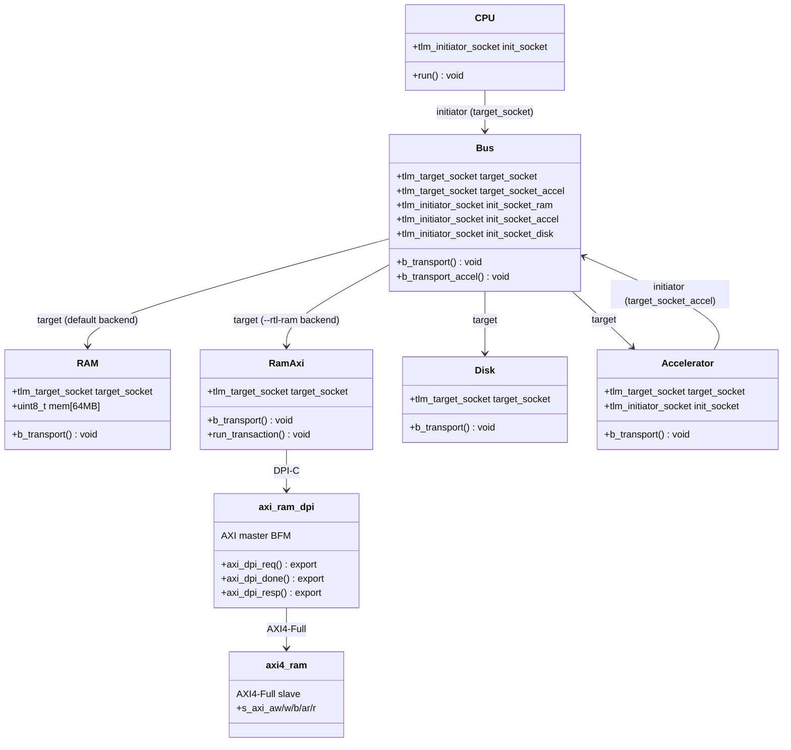
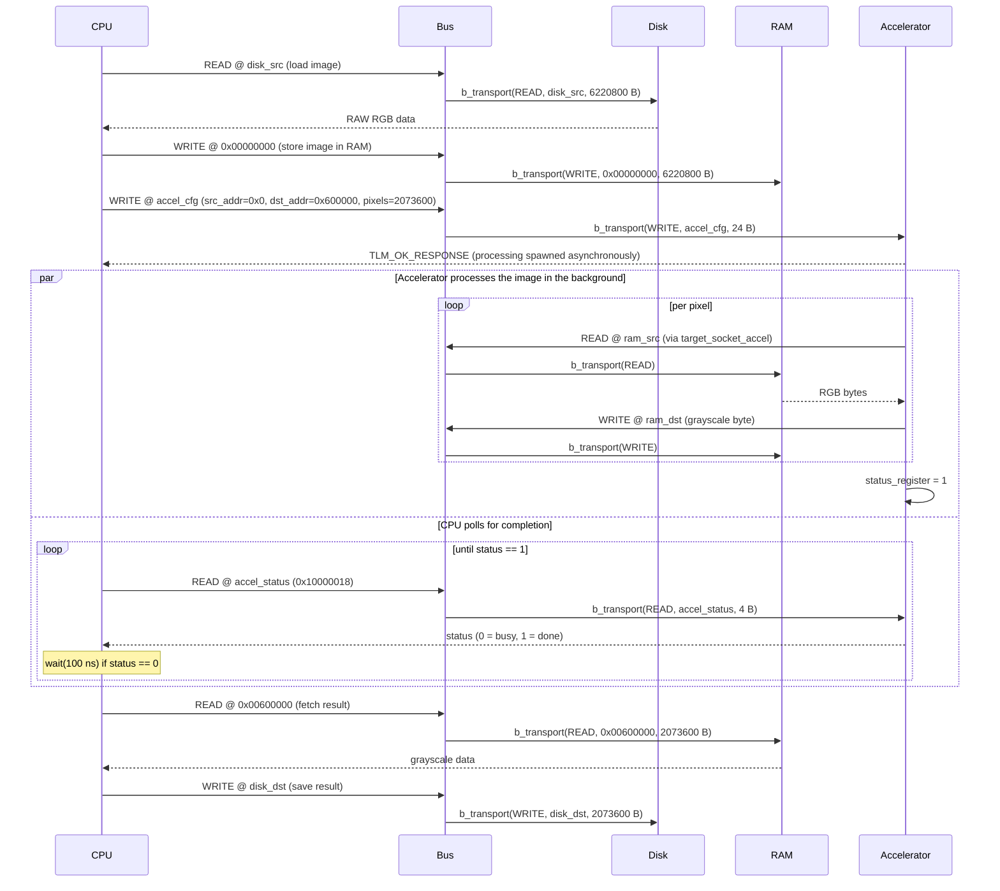
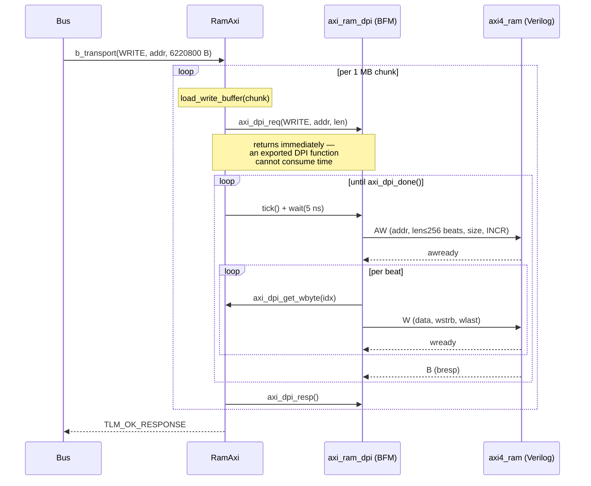

# Image Accelerator — SystemC/TLM + AXI4-Full RTL + UVM

> Academic project — Diseño de Alto Nivel (MP6160), 2C 2026 · Due **2026-07-30**

An electronic system-level model of an embedded platform that converts 1080p RAW RGB images to grayscale.

The system is modelled in **SystemC** with **TLM 2.0**, and its RAM is additionally described in **Verilog with an AXI4-Full port**, verified by a **UVM/SystemVerilog** testbench and plugged back into the SystemC model over **DPI-C**. The same simulation therefore runs in two interchangeable configurations:

| Backend | How | What it exercises |
|---|---|---|
| C++ behavioural RAM | `make run` | The TLM 2.0 model on its own (Evaluación 2 baseline) |
| Verilog AXI4-Full RAM | `make run-rtl` | The RTL driven over DPI-C by an AXI master BFM |

---

## Table of Contents

The six sections required by the assignment, in order:

1. [Requirements & Build Instructions](#requirements--build-instructions)
2. [Repository Organization](#repository-organization)
3. [Module Organization](#module-organization)
4. [Block Diagram](#block-diagram)
5. [Sequence Diagram](#sequence-diagram)
6. [Results](#results)

Plus:

- [RTL & UVM Verification](#rtl--uvm-verification)
- [Further Documentation](#further-documentation)
- [AI-Assisted Development](#ai-assisted-development)

---

## Requirements & Build Instructions

There are two ways to build this project:

1. **[Development Container](#development-container) (recommended)** — Docker-based, every dependency (including a pre-compiled SystemC 2.3.4) is already installed inside the container, so the build is identical regardless of host OS. No local toolchain setup needed.
2. **[Local Build](#local-build)** — install the [prerequisites](#system-prerequisites) directly on your machine and build with `make`.

### Development Container

The repository ships a ready-to-use dev container that pre-installs all dependencies (including a compiled SystemC 2.3.4), so anyone who clones it gets an identical Linux build environment regardless of their host OS.

#### VS Code (recommended)

1. Install the [Dev Containers](https://marketplace.visualstudio.com/items?itemName=ms-vscode.remote-containers) extension (`ms-vscode.remote-containers`)
2. Open the repository in VS Code
3. When prompted, click **Reopen in Container** (or run the command `Dev Containers: Reopen in Container`)
4. The container builds once (~3–5 min on first run), then `make` runs automatically to verify the setup

The following extensions are pre-installed inside the container:
- **C/C++** (`ms-vscode.cpptools`) — IntelliSense, debugging
- **CMake Tools** (`ms-vscode.cmake-tools`) — build integration

#### Docker CLI (without VS Code)

```bash
docker build -t systemc-tlm .devcontainer/
docker run -it --rm -v $(pwd):/workspace -w /workspace systemc-tlm make run
```

#### GitHub Codespaces

The same `devcontainer.json` works on [GitHub Codespaces](https://github.com/features/codespaces) — click **Code → Codespaces → Create codespace** for a cloud-hosted environment with no local install required.

### Local Build

#### System prerequisites

| Dependency | Minimum version | Notes |
|---|---|---|
| C++ compiler | GCC ≥ 9 or Clang ≥ 10 | Must support C++17 |
| CMake | ≥ 3.16 | Used for both building and fetching SystemC |
| Git | any | To clone the repository |
| Internet access | — | Required on first build to download SystemC (skipped if `$SYSTEMC_HOME` is set) |

**Linux (Ubuntu/Debian):**
```bash
sudo apt-get update
sudo apt-get install -y build-essential cmake git
```

**macOS:**
```bash
xcode-select --install       # provides clang and make
brew install cmake git
```

#### Build

```bash
git clone <repository-url>
cd <repository>
make      # configure + download SystemC (first run ~1-2 min) + compile
make run  # build and run the simulation
make clean  # delete build directory
```

On the first run, CMake downloads and compiles SystemC 2.3.4 automatically. Subsequent builds use the cached version inside `build/`.

If SystemC is already installed, set `$SYSTEMC_HOME` before running `make` to skip the download:

```bash
export SYSTEMC_HOME=/opt/systemc   # adjust to your install path
make run
```

#### RTL backend (optional)

`make run` uses the C++ RAM and needs nothing beyond the above. To run the system against the **Verilog AXI4-Full RAM** instead, install [Verilator 5](https://verilator.org/guide/latest/install.html) and:

```bash
make lint      # verilator --lint-only -Wall on src/rtl/
make run-rtl   # same pipeline, RAM served by the Verilog RTL over DPI
```

> ⚠️ **Verilator cannot build from a path containing spaces.** Its `verilated.mk` is a GNU Make file, and CMake's `verilate()` fails too. Clone into a space-free path, or use the [dev container](#development-container), which mounts at `/workspace`. `scripts/build_rtl.sh` detects this and tells you. CI is unaffected.

Without Verilator the project still builds — `sim` just rejects `--rtl-ram` with an explanatory message.

### CI / CD

Every pull request triggers [build.yml](.github/workflows/build.yml), which runs four jobs:

| Job | What it does | Blocking |
|---|---|---|
| `changes` | Decides whether anything relevant changed, so docs-only PRs skip the heavy jobs | — |
| `deliverables` | Checks that every artifact the assignment requires actually exists in the repo | ✅ |
| `lint` | `verilator --lint-only -Wall` over the RTL **and** the DPI wrapper | ✅ |
| `build` | Builds the dev container, runs **both** RAM backends, compares their output byte for byte, regenerates the JPGs, and commits the live results back to the PR branch | ✅ |

Both backends run in the same job on purpose: they need the same container, and building it twice doubled CI time for nothing.

> **The UVM testbench does not run in CI.** Vivado is not available on GitHub-hosted runners, so `scripts/run_uvm.sh` is run locally and its XSim log attached to the pull request as evidence. See [RTL & UVM Verification](#rtl--uvm-verification).

The results commit carries `[skip ci]` so that CI pushing to the branch does not re-trigger itself.

---

## Repository Organization

```
.
├── .devcontainer/
│   ├── Dockerfile                 # Linux image with SystemC pre-built
│   └── devcontainer.json          # VS Code / Codespaces dev container config
├── .github/
│   └── workflows/
│       └── build.yml              # CI: deliverables, lint, build+results, RTL equivalence
├── docs/
│   ├── CrearModuloSystemC.md      # Step-by-step guide for implementing a new module
│   ├── ArquitecturaDPI.md         # RTL port map + DPI bridge design (Spanish)
│   ├── PlanUVM.md                 # Verification plan: features, tests, coverage
│   ├── ModeloSystemC.md           # TLM transaction format + address map (Spanish)
│   ├── Enunciado.md               # Assignment specification (Spanish)
│   └── old/Enunciado.md           # Previous assignment (Evaluación 2), for reference
├── images/
│   ├── input/                     # Input RAW RGB images (place here before running)
│   └── output/                    # Grayscale output images (written here by sim)
├── scripts/
│   ├── prepare_input.py           # Converts/generates images/input/image.raw for the sim
│   ├── raw_to_jpg.py              # Converts a headerless RAW file back to JPG/PNG for viewing
│   ├── jpg_to_raw.py              # Converts a JPG/PNG into headerless RAW for the sim
│   ├── generate_results.py        # Extracts sim time, byte counts, and BT.601 pixel checks for CI
│   ├── check_deliverables.sh      # Verifies every artifact the assignment requires exists
│   ├── build_rtl.sh               # Verilates the RTL + DPI bridge (standalone, no CMake)
│   ├── run_uvm.sh                 # Runs the UVM testbench in Vivado XSim (Linux/macOS)
│   ├── run_uvm_windows.ps1        # Same flow on Windows: env setup → clone → sim → exports/
│   └── run_uvm_windows.bat        # Launcher for the PowerShell script
├── src/                           # All source, grouped by subsystem
│   ├── model/                     # SystemC / TLM 2.0 model
│   │   ├── modules/
│   │   │   ├── accelerator/       # accelerator.h / .cpp
│   │   │   ├── bus/               # bus.h / .cpp
│   │   │   ├── cpu/               # cpu.h / .cpp
│   │   │   ├── disk/              # disk.h / .cpp
│   │   │   ├── ram/               # ram.h / .cpp — C++ reference RAM
│   │   │   └── ram_axi/           # TLM ↔ DPI bridge to the Verilog RAM
│   │   ├── config/
│   │   │   ├── memory_map.h       # Bus address map constants
│   │   │   └── image_config.h     # Image dimension constants
│   │   ├── utils/
│   │   │   └── conversion.h       # Pure BT.601 helper (no SystemC dependency)
│   │   ├── infra/
│   │   │   └── logger.h           # Centralized console logging
│   │   └── sc_main.cpp            # sc_main — top-level instantiation and sc_start()
│   ├── rtl/
│   │   └── axi4_ram.v             # 64 MB RAM with an AXI4-Full slave port (Verilog-2001)
│   ├── tb/
│   │   ├── uvm/                   # UVM testbench for axi4_ram (agent, scoreboard, sequences)
│   │   └── files.f                # Filelist consumed by xvlog
│   └── dpi/
│       ├── axi_ram_dpi.svh        # DPI contract — SystemVerilog side (frozen)
│       ├── axi_ram_dpi.h          # DPI contract — C++ side (frozen)
│       ├── axi_ram_dpi.sv         # AXI master BFM + axi4_ram instance
│       └── axi_ram_dpi.cpp        # Verilated model owner + clock ticking
├── AGENTS.md                      # AI assistant instructions
├── CMakeLists.txt                 # Build system; auto-fetches SystemC if needed
├── CLAUDE.md                      # Context file for Claude Code
├── Makefile                       # Thin CMake wrapper
└── README.md
```

---

## Module Organization



`RAM` and `RamAxi` expose the identical `simple_target_socket`, so `sc_main` binds whichever one the `--rtl-ram` flag selects and the Bus never knows the difference.

| Module | Files | Language | Role | Responsibility |
|---|---|---|---|---|
| **CPU** | `src/model/modules/cpu/` | SystemC | Initiator | Orchestrates the flow: load → store → configure → poll → fetch → save |
| **Bus** | `src/model/modules/bus/` | SystemC | Target + Initiator | Routes transactions to the right target by address range |
| **RAM** | `src/model/modules/ram/` | SystemC | Target | 64 MB behavioural memory. Default backend and golden reference |
| **RamAxi** | `src/model/modules/ram_axi/` | SystemC | Target | Same socket as `RAM`, but serves every transaction from the Verilog RTL over DPI-C |
| **Disk** | `src/model/modules/disk/` | SystemC | Target | Maps READ/WRITE transactions to filesystem I/O. The only module touching the OS |
| **Accelerator** | `src/model/modules/accelerator/` | SystemC | Target + Initiator | On the 24-byte config WRITE, spawns the BT.601 conversion loop |
| **axi_ram_dpi** | `src/dpi/` | SystemVerilog | AXI master | BFM that turns DPI requests into AXI4 bursts, respecting the 4 KB boundary and the 256-beat limit |
| **axi4_ram** | `src/rtl/` | Verilog-2001 | AXI4-Full slave | The RAM described in RTL — the deliverable the assignment asks for |
| **UVM testbench** | `src/tb/uvm/` | SystemVerilog | Verification | Independently verifies `axi4_ram` against a reference model |

The transaction format and address map are documented in [docs/ModeloSystemC.md](docs/ModeloSystemC.md).

---

## Block Diagram

The architecture proposed for this assignment. Everything left of the dashed line is SystemC; everything right of it is RTL, reached over DPI-C.

```mermaid
graph LR
    CPU <-->|TLM 2.0| Bus
    Bus <-->|TLM 2.0| Accelerator
    Bus <-->|TLM 2.0| Disk

    Bus <-->|TLM 2.0| RAM["RAM<br/>(C++ behavioural)"]
    Bus <-->|TLM 2.0| RamAxi["RamAxi<br/>(TLM target)"]

    RamAxi <-->|DPI-C| BFM["axi_ram_dpi<br/>(AXI master BFM)"]
    BFM <-->|AXI4-Full| RTL["axi4_ram<br/>(Verilog RTL)"]

    UVM["UVM testbench<br/>(Vivado XSim)"] -.->|verifies| RTL

    subgraph SystemC
        CPU
        Bus
        Accelerator
        Disk
        RAM
        RamAxi
    end

    subgraph RTL
        BFM
        RTL
    end
```

The RAM has **two interchangeable implementations**. `RAM` and `RamAxi` are never both instantiated: `sc_main` picks one according to `--rtl-ram` and binds it to `bus.init_socket_ram`. The C++ one acts as the golden reference the RTL is compared against.

The same `axi4_ram` feeds two independent flows — Verilator compiles it for the SystemC co-simulation, Vivado XSim elaborates it for the UVM testbench. That is why the RTL is plain synthesizable Verilog-2001: the two tools do not accept the same SystemVerilog subset.

### CPU

The CPU orchestrates the entire processing pipeline. It initiates all TLM transactions: loading the raw image from Disk into RAM, configuring the Accelerator with the source address, destination address, and pixel count, then polling the Accelerator's status register every 100 ns until processing is done, and finally fetching the processed image back from RAM and saving it to Disk. The CPU holds no image data locally — RAM is the only intermediate buffer.

### Bus

The Bus has two TLM target sockets: `target_socket`, for transactions coming from the CPU, and `target_socket_accel`, for transactions coming from the Accelerator. The CPU-facing socket decodes the address and routes it to RAM (`0x00000000`–`0x03FFFFFF`), Accelerator (`0x10000000`–`0x1FFFFFFF`), or Disk (`0x20000000`–`0x2FFFFFFF`); the Accelerator-facing socket only forwards to RAM, since the Accelerator only ever reads/writes pixel data there. All inter-module communication passes through the Bus.

### RAM

A 64 MB byte-addressable memory array. It holds the input RGB image starting at `0x00000000` and the output grayscale image starting at `0x00600000`. All inter-module data exchange passes through RAM — neither the CPU nor the Accelerator transfer image data directly to each other.

### Disk

Models the persistent file system as a SystemC module. A TLM READ transaction causes it to open the specified image file and return its bytes; a TLM WRITE transaction creates or overwrites a file with the provided data. It is the only module that performs actual filesystem I/O, keeping the rest of the system independent of the host OS.

### Accelerator

On receiving a 24-byte WRITE to its configuration register at `0x10000000`, the Accelerator spawns an asynchronous process (`sc_spawn`) that reads the source RGB pixels from RAM, converts each pixel to grayscale, and writes the result back to RAM at the destination address — the configuration WRITE itself returns immediately, it does not block until processing is done. While processing, a status register at `0x10000018` reads `0`; once the loop finishes, it's set to `1` so the polling CPU can proceed. It uses the **BT.601 luminosity formula**:

```
Gray = 0.299 × R + 0.587 × G + 0.114 × B
```

**Input:** 3 bytes per pixel (RGB, values 0–255)  
**Output:** 1 byte per pixel (Grayscale, 0–255, rounded)

This formula reflects human eye sensitivity to different color channels:
- Green (58.7%): highest sensitivity
- Red (29.9%): medium sensitivity
- Blue (11.4%): lowest sensitivity

**Example:** RGB(100, 150, 200) → 0.299×100 + 0.587×150 + 0.114×200 = 140.75 ≈ 141 (grayscale)

See [Roboflow Image Convert Grayscale](https://inference.roboflow.com/workflows/blocks/image_convert_grayscale/) for reference.

---

## Sequence Diagram



### Inside one RAM transaction, RTL backend

The diagram above is backend-agnostic: `Bus → RAM` is a single `b_transport` call. With `--rtl-ram` that one call expands into the sequence below, which is where the DPI bridge and the AXI4 handshakes live.



Three things worth noting in that flow:

- **The request/poll pattern is not a stylistic choice.** Verilator forbids an exported DPI function from consuming simulation time, so `axi_dpi_req()` only enqueues; the BFM advances inside its `always_ff` while the C++ side ticks the clock and polls `axi_dpi_done()`.
- **Chunking happens in SystemC, not in the DPI contract.** The CPU moves the whole image in one `b_transport`, but the bridge's exchange buffer is 1 MB, so `RamAxi` splits it. Keeping the split above the contract means the buffer size is not tied to the image size.
- **Simulated time becomes meaningful here.** Every tick advances `sc_time_stamp()`, unlike the C++ backend where annotated delays are computed and discarded.

For the full port map, the frozen DPI contract and the BFM state machine, see [docs/ArquitecturaDPI.md](docs/ArquitecturaDPI.md).

---

## Results

> Images and the tables below are regenerated **and committed automatically** by CI ([build.yml](.github/workflows/build.yml)) on every pull request that touches `src/`, `scripts/`, or the input image — `scripts/generate_results.py` writes real measured values straight into this README between the `<!-- RESULTS:* -->` markers, so the numbers below are never hand-copied.

### Backend comparison

Both RAM backends run the same 1080p pipeline, and CI compares their output byte for byte. The figures come straight from the two runs:

<!-- RESULTS:BACKENDS:START -->
| RAM backend | How | Simulated time at stop | Status |
|---|---|---|---|
| C++ behavioural | `make run` | 100 ns | ✅ runs |
| Verilog AXI4-Full (DPI) | `make run-rtl` | 210.05 ms | ✅ runs |
<!-- RESULTS:BACKENDS:END -->

The gap in simulated time is the whole point. The C++ backend computes annotated delays and throws them away, so its 100 ns is just the CPU's polling `wait()`. The RTL backend advances a real clock, so its figure is an actual transfer cost.

The byte counts and pixel checks below are identical for both backends — that is what `cmp` verifies.

### Output image

| Input (RGB) | Output (Grayscale) |
|:-----------:|:------------------:|
|  |  |

The output is visually correct because BT.601 weights each channel by human eye sensitivity (green 58.7%, red 29.9%, blue 11.4%): every feature from the input — mountains, sun, lake reflection, tree line, golden and blue vegetation — stays distinguishable, and the blue-toned vegetation (high blue+green) renders lighter than the similarly-bright golden vegetation (high red, low blue), as the weighting predicts.

### Data volume

A 1920×1080 image has 2,073,600 pixels. RGB input is 3 B/pixel, grayscale output is 1 B/pixel, so the expected byte counts are 2,073,600 × 3 = 6,220,800 B (Disk → RAM) and 2,073,600 × 1 = 2,073,600 B (RAM → Disk). `scripts/generate_results.py` reads `images/input/image.raw` / `images/output/output.raw` directly on every CI run and fills in the measured values below:

<!-- RESULTS:DATA-VOLUME:START -->
| Transfer | Expected | Actual | Match |
|---|---|---|---|
| Disk → RAM (input) | 6,220,800 B | 6,220,800 B | ✅ |
| RAM → Disk (output) | 2,073,600 B | 2,073,600 B | ✅ |
| Total moved | 8,294,400 B | 8,294,400 B | ✅ |
<!-- RESULTS:DATA-VOLUME:END -->

### Pixel-level conversion check

On every CI run, `scripts/generate_results.py` samples 4 pixels, recomputes BT.601 independently in Python from the input RGB, and compares against what the C++ Accelerator (`src/utils/conversion.h`) actually wrote — confirming correctness at the pixel level, not just by eye:

<!-- RESULTS:PIXELS:START -->
| Pixel # | RGB | Expected gray (BT.601) | Actual gray | Match |
|---|---|---|---|---|
| 0 | (139, 118, 209) | 135 | 135 | ✅ |
| 518,400 | (192, 173, 205) | 182 | 182 | ✅ |
| 1,036,800 | (59, 56, 47) | 56 | 56 | ✅ |
| 2,073,599 | (45, 48, 101) | 53 | 53 | ✅ |
<!-- RESULTS:PIXELS:END -->

### Pipeline phases

The CPU logs 5 phases, in a fixed order with no branching (`CPU::run()` executes them sequentially):

| CPU log | Action |
|---|---|
| `[1/5] Loading image from disk` | CPU reads the RAW RGB image from persistent storage (Disk) |
| `[2/5] Storing image in RAM` | CPU writes the loaded image into RAM |
| `[3/5] Configuring accelerator` | CPU sends source address, destination address, and pixel count to the Accelerator |
| `[4/5] Processing image` | Accelerator reads RGB from RAM, converts to grayscale, writes the result back to RAM — CPU only polls the status register |
| `[5/5] Saving result to disk` | CPU reads the processed image from RAM and writes it to Disk |

Together these cover the assignment's full flow. The remaining requirement — that the input image be RAW RGB at 1080p — is a precondition on the file in `images/input/`, not a runtime action, so it has no corresponding phase.

### Simulated vs. wall-clock time

**C++ backend.** `sc_time_stamp()` reports <!-- RESULTS:SIMTIME:START -->**100 ns**<!-- RESULTS:SIMTIME:END --> at stop, which says nothing about real execution time (the real run takes milliseconds to a few seconds depending on host CPU). Every `b_transport` annotates a local delay — CPU 10 ns, Bus 5 ns, RAM 10 ns, Disk 100 ns — but none of them is ever consumed with `wait()`: they are computed and discarded. The only call that actually advances simulated time is the single `wait(100 ns)` in `CPU::wait_accelerator_ready()`'s polling loop. This is a **loosely-timed** TLM model: functionally accurate, not timing-accurate.

**RTL backend.** This changes qualitatively. `RamAxi` advances the RTL clock one edge at a time and pairs every edge with a `wait(5 ns)`, so simulated time tracks the actual AXI handshakes. A single 1 MB chunk already costs on the order of tens of milliseconds of simulated time. That number is a real transfer cost, not an artefact — which is why the RTL backend is the only configuration in which `sc_time_stamp()` is worth quoting at all.

Consuming the annotated delays in the C++ backend so both configurations report meaningful time is tracked as a follow-up enhancement, not a requirement of this assignment.

---

## RTL & UVM Verification

The Verilog RAM is verified on two independent fronts.

### 1. UVM testbench (Vivado XSim)

`src/tb/uvm/` holds a UVM environment that drives `axi4_ram` directly, with no SystemC involved: an active AXI4 master agent, a scoreboard with its own reference model, and covergroups over burst length, burst size, burst type and `WSTRB`.

```bash
# Linux / macOS — Vivado must be on the PATH
source /tools/Xilinx/Vivado/2019.2/settings64.sh
./scripts/run_uvm.sh smoke_test

# Windows — loads the Vivado environment itself, runs every test,
# and writes logs, waveforms and coverage to exports\<timestamp>\
scripts\run_uvm_windows.bat
```

XSim ships **UVM 1.2**, enabled with `-L uvm`. Both scripts parse the final UVM report and exit non-zero when it shows errors, because `xsim` returns 0 regardless.

The testbench runs against a reduced `MEM_DEPTH` (64 KB) — XSim cannot hold a 64 MB array.

> ⚠️ **This does not run in CI.** Vivado is not available on GitHub-hosted runners, so the XSim log is attached to the pull request as evidence instead. The verification plan, feature list and coverage goals are in [docs/PlanUVM.md](docs/PlanUVM.md).

### 2. Equivalence against the C++ reference (CI)

The other front is automated. Running the same 1080p image through both RAM backends and comparing the output byte for byte checks the RTL over 8,294,400 bytes of real traffic:

```bash
make run     && cp images/output/output.raw /tmp/reference.raw
make run-rtl && cmp /tmp/reference.raw images/output/output.raw
```

That is exactly what the `rtl-equivalence` job does on every pull request. The two approaches are complementary: UVM proves protocol compliance with directed and random stimulus, the equivalence run proves the RTL behaves correctly under the access pattern the real system produces.

---

## Further Documentation

| Document | Contents |
|---|---|
| [docs/ArquitecturaDPI.md](docs/ArquitecturaDPI.md) | AXI4-Full port map, the frozen DPI-C contract, the BFM state machine, and the gotchas hit while implementing it |
| [docs/PlanUVM.md](docs/PlanUVM.md) | Verification plan: 11 features, 6 tests, coverage goals, how to run them |
| [docs/ModeloSystemC.md](docs/ModeloSystemC.md) | TLM transaction format and the address map (required by the previous assignment, kept for reference) |
| [docs/CrearModuloSystemC.md](docs/CrearModuloSystemC.md) | Step-by-step guide for adding a SystemC/TLM module to this project |
| [docs/Enunciado.md](docs/Enunciado.md) | The assignment specification |

---

## AI-Assisted Development

Declared as required by course policy — see [docs/Enunciado.md](docs/Enunciado.md).

> **Using Claude Code?** Run `/log-ai` in any Claude Code session inside this repo to append a row to the table below automatically. The command asks for model, type of use, and prompt description.


| Model | Type of use | Prompt |
|---|---|---|
| Claude Sonnet 4.6 ([Claude Code](https://claude.ai/code)) | Concept lookup, code generation, documentation generation, diagram generation | *"Create the base repo: readme, gitignore, C++ SystemC template, makefile, cmake with auto-fetch of SystemC, and CI/CD pipeline for PRs. Generate a complete README with all sections required by the assignment spec; include Mermaid diagrams (block, sequence), transaction format, and memory map as base templates to be updated once the system is implemented."* |
| Claude Sonnet 4.6 ([Claude Code](https://claude.ai/code)) | Documentation generation, code generation | *"Create docs/CrearModuloSystemC.md: a step-by-step guide for implementing a SystemC/TLM module in this project, using the Accelerator as a reference example. Covers header, cpp, conversion.h, CMakeLists, main.cpp wiring, memory map, and config format documentation."* |
| Claude Sonnet 4.6 ([Claude Code](https://claude.ai/code)) | code generation, concept lookup | *"Create a Claude Code skill following Anthropic's official skill guide to automate AI usage logging (/log-ai), placed at .claude/skills/log-ai/SKILL.md, with context inference so it derives model, type of use, and prompt from the conversation automatically."* |
| Claude Sonnet 4.6 ([Claude Code](https://claude.ai/code)) | debugging, code generation, code review, documentation generation | *"Audit the project against the assignment spec, fix the gaps found (a RAM logging performance bug, missing RAW image deliverables, repo restructuring into modules/config/infra/utils), automate publishing simulation results in CI, file an issue for a discovered TLM routing bug, and bring the README's diagrams and Results/Discussion sections in line with the actual code and real simulation data."* |
| Claude Opus 5 ([Claude Code](https://claude.ai/code)) | concept lookup, code generation, documentation generation | *"Read the new assignment (Evaluación 4) and turn the forked Evaluación 2 SystemC/TLM project into the template we start from: choose the toolchain (Vivado XSim for the UVM testbench, Verilator for the SystemC co-simulation) and justify the trade-offs, restructure the repo under src/ by subsystem (model, rtl, tb, dpi) following our sibling repo's convention, and scaffold each layer — frozen AXI4-Full port map, frozen DPI-C contract, build and simulation scripts, CI lint job, and the architecture and verification-plan docs — without implementing the graded deliverables themselves."* |
| Claude Opus 5 ([Claude Code](https://claude.ai/code)) | documentation generation, code review | *"Generate the commit messages and pull request descriptions for this work by analysing the pushed diff, so that each PR explains the actual design decisions taken, the verification performed and its results, and what remains blocked by other issues — rather than restating the list of changed files."* |
